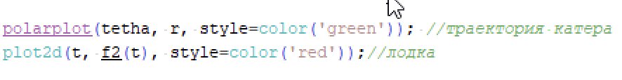

---
# Front matter
title: "Отчёт по лабораторной работе №2"  
subtitle: "Вариант 39"  
author: "Александр Олегович Воробьев"

# Generic otions
lang: ru-RU
toc-title: "Содержание"

# Bibliography
bibliography: bib/cite.bib
csl: pandoc/csl/gost-r-7-0-5-2008-numeric.csl

# Pdf output format
toc: true # Table of contents
toc_depth: 2
lof: true # List of figures
lot: true # List of tables
fontsize: 12pt
linestretch: 1.5
papersize: a4
documentclass: scrreprt
## I18n
polyglossia-lang:
  name: russian
  options:
	- spelling=modern
	- babelshorthands=true
polyglossia-otherlangs:
  name: english
### Fonts
mainfont: PT Serif
romanfont: PT Serif
sansfont: PT Sans
monofont: PT Mono
mainfontoptions: Ligatures=TeX
romanfontoptions: Ligatures=TeX
sansfontoptions: Ligatures=TeX,Scale=MatchLowercase
monofontoptions: Scale=MatchLowercase,Scale=0.9
## Biblatex
biblatex: true
biblio-style: "gost-numeric"
biblatexoptions:
  - parentracker=true
  - backend=biber
  - hyperref=auto
  - language=auto
  - autolang=other*
  - citestyle=gost-numeric
## Misc options
indent: true
header-includes:
  - \linepenalty=10 # the penalty added to the badness of each line within a paragraph (no associated penalty node) Increasing the value makes tex try to have fewer lines in the paragraph.
  - \interlinepenalty=0 # value of the penalty (node) added after each line of a paragraph.
  - \hyphenpenalty=50 # the penalty for line breaking at an automatically inserted hyphen
  - \exhyphenpenalty=50 # the penalty for line breaking at an explicit hyphen
  - \binoppenalty=700 # the penalty for breaking a line at a binary operator
  - \relpenalty=500 # the penalty for breaking a line at a relation
  - \clubpenalty=150 # extra penalty for breaking after first line of a paragraph
  - \widowpenalty=150 # extra penalty for breaking before last line of a paragraph
  - \displaywidowpenalty=50 # extra penalty for breaking before last line before a display math
  - \brokenpenalty=100 # extra penalty for page breaking after a hyphenated line
  - \predisplaypenalty=10000 # penalty for breaking before a display
  - \postdisplaypenalty=0 # penalty for breaking after a display
  - \floatingpenalty = 20000 # penalty for splitting an insertion (can only be split footnote in standard LaTeX)
  - \raggedbottom # or \flushbottom
  - \usepackage{float} # keep figures where there are in the text
  - \floatplacement{figure}{H} # keep figures where there are in the text
---

# Цель работы

Изучить задачу о погоне и реализовать модель траекторий (лодки и катера) программно. 

# Задание

На море в тумане катер береговой охраны преследует лодку браконьеров. Через определенный промежуток времени туман рассеивается, и лодка обнаруживается на расстоянии 21 км от катера. Затем лодка снова скрывается в тумане и уходит прямолинейно в неизвестном направлении. Известно, что скорость катера в 5,5 раза больше скорости браконьерской лодки.  

1. Записать уравнение описывающее движение катера, с начальными условиями для двух случаев.  
2. Построить траекторию движения катера и лодки для вдух случаев.  
3. Найти точку персечения траектории катера и лодки.  

# Теоретическое введение

Полярная система координат — двумерная система координат, в которой каждая точка на плоскости определяется двумя числами — полярным углом и полярным радиусом. Полярная система координат особенно полезна в случаях, когда отношения между точками проще изобразить в виде радиусов и углов.  

После того, как катер береговой охраны окажется на одном расстоянии от
полюса, что и лодка, он должен сменить прямолинейную траекторию и начать двигаться вокруг полюса удаляясь от него со скоростью лодки v.

Скорость катера раскладывается на две составляющие: vr -
радиальная скорость и vt - тангенциальная скорость.  

Радиальная скорость - это скорость, с которой катер удаляется от полюса.  

Тангенциальная скорость – это линейная скорость вращения катера относительно полюса.

# Выполнение лабораторной работы

**1. Проводим рассуждения, аналогичные примеру.** 

	Обозначаем исходные данные из условия, выражаем время, пройденное за расстояние х:
{ #fig:001 width=70% }  

	Находим значения х1 и х2 для первого и второго случая соответственно:  
{ #fig:002 width=70% }  
{ #fig:003 width=70% } 

	Раскладываем скорость катера на две составляющие: радиальную и тангенциальную скорость:  
{ #fig:004 width=70% } 

	Получаем систему из двух дифференциальных уравнений:  
{ #fig:005 width=70% } 

	Решаем систему со следующими начальными условиями:  
{ #fig:006 width=70% } 

	Исключая из полученной системы производную по t, переходим к следующему уравнению:  
{ #fig:007 width=70% } 

**2. Пишем программу для построения модели, описывающей траектории лодки и катера.**  

	Задаём начальное расстояние от лодки до катера, указанное в условии варианта, угол fi в полярных координатах из примера:  
{ #fig:008 width=70% }  

	Прописываем функцию dr, описывающую движение катера береговой охраны:  
{ #fig:009 width=70% }  

	Подставляем значения r0 и tetha для первого случая:  
{ #fig:010 width=70% }  

	Tetha меняется от 0 до pi^2^:  
{ #fig:011 width=70% }  

	Прописываем функцию xt, которая описывает движение лодки:  
{ #fig:012 width=70% }  

	Переменная t принимает значения от 0 до 30:  
{ #fig:013 width=70% }  

	Вызывая функции polarplot и plot2d строим траектории катера и лодки для первого случая:  
{ #fig:014 width=70% } 

	Запускаем программу для отображения модели с траекториями для первого случая:  
{ #fig:015 width=70% } 

	Меняем значения r0 и tetha под второй случай:  
{ #fig:016 width=70% }  

	Запускаем программу для отображения модели с траекториями для второго случая:  
{ #fig:017 width=70% } 

# Выводы

В ходе выполнения лабораторной работы я изучил теорию для решения задачи о погоне и реализовал модели для двух случаев, допускаемых этой задачей.  

# Список литературы{.unnumbered}

	1. Кулябов Д.С. Задача о погоне. - 4 с. 
	2. Полярная система координат [Электронный ресурс]: Википедия. Свободная энциклопедия. - URL: https://ru.wikipedia.org/wiki/Полярная_система_координат (дата обращения: 18.02.2022)

::: {#refs}
:::